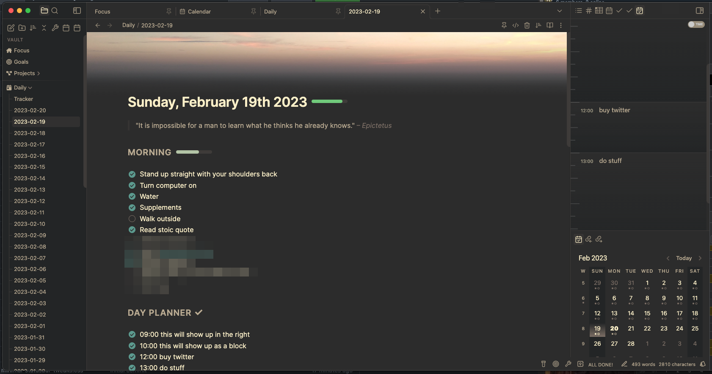
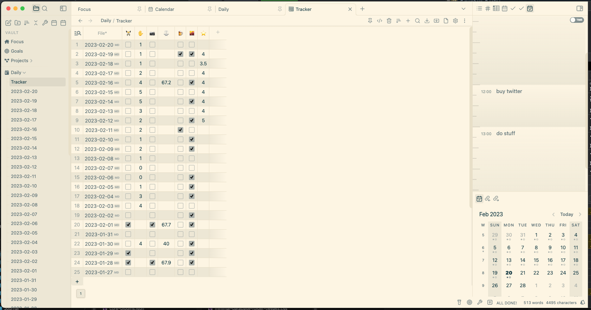

# Replete's Obsidian CSS snippets for Minimal Theme (for Obsidian `v1.1.19`)

Basically, this a folder of CSS snippets which are designed to smooth out visual, and sometimes interactive, problems with the various community plugins used for common workflows with the popular minimal theme.

The main drive is to make everything look like one app. The benefit of using the [@kepano](https://github.com/kepan)'s [Minimal Theme](https://github.com/kepano/obsidian-minimal) is an emerging ecosystem and standardisation of various aspects of Obsidian, which is constantly being developed.

It's a work in progress as I work on my own Vault, so the best bet is to activate the snippets individually with the `MySnippets` plugin and decide if you want it or not.

Most of these snippets are exclusively suited to the minimal theme, but some will also work on anything else, such as `hide-ribbon`, `minimal-make-tweaks` and a few others.

It's opnionated, an example of which is that I prefer more condensed views, so this might not be for everyone but this isn't for everyone, it's for me, and I'd rather see more stuff on a smaller display. It's going to change over time, but feel free to steal what suits you,

Likely to change over time, probably most useful to other hackers working on their vault

## Gotchas

- MacOS: I haven't tested these on Windows or Linux, as I use a mac for day to day work. This can be fixed easily with os-specific body css classes (such as `body.mod-macos` etc) but I haven't done this because I'm not sharing this vault with Windows yet. If/when I do need to do this I'll fix everything.
- Desktop: I haven't fixed anything for mobile Obsidian yet, but when I get around to using obsidian on mobile I will fix these

## Screenshots (incomplete)

## Recommended Community plugins

- `MySnippets` to toggle individual CSS snippet files on/off from statusbar
- `Minimal Theme Settings` to select colour schemes/options for the minimal theme via GUI
- `MAKE.MD` for the banner functionality, but you must disable 'Spaces' to make 'Custom File Explorer Sorting' plugin work
- `Database Folders` to create table views of habits
- ... too many to list, but if its useful I've probably made some CSS for it

## How to use

1. Clone/fork this repo into `<your vault location>/.obsidian/snippets` and make changes as needed
2. Dupe existing files and modify to your requirements
3. Install the `MySnippets` community plugin by [chetachiezikeuzor](https://github.com/chetachiezikeuzor) and activate snippets individually through the icon in the bottom right of the statusbar
4. Make new snippets, maybe contribute if you have fixes, improvements or whatever - make an issue or PR perhaps, but I can't guarantee anything as I'm basically just sharing my work

## Versions / updates

Its in my own interest to keep Obsidian and the various plugins up to date, but life gets busy and there may be a delay - so I will make incremental updates to the repo (via commits) to update/improve plugins as they are updated but when a new version of Obsidian is released, I'll tag the last commit with that verison number. So all commits previous to 
that will support that version. Basically, this repo assumes your Obsidian is up to date and also assumes I have fixed it.

No warranties or guarantees, please don't ask for plugin X to be supported - if you want it, do it. If I want it, it will already exist here. Please submit fixes or any great ideas though and if it makes sense to me I'll include it.

I'm using Obsidian every day for more and more things, so chances are I'll keep updating this repo

-Phil
