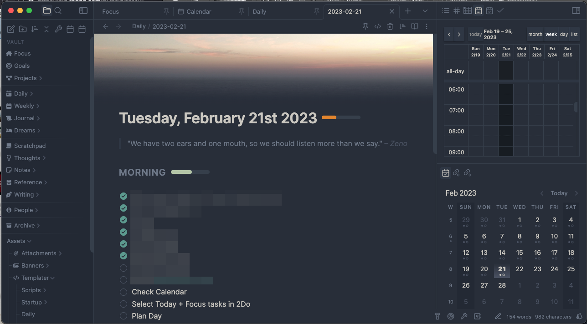

# Replete's Obsidian CSS snippets for Minimal Theme



This is my working folder of CSS snippets for Obsidian using [@kepano](https://github.com/kepan)'s [Minimal Theme](https://github.com/kepano/obsidian-minimal). There are opinionated tweaks and fixes for various plugins and aspects of Obsidian's UI organized into separate CSS files.

### Features
(some screenshots will be out of date)
- Editor:
    - [Custom Tag Styles](https://i.imgur.com/Zc9DLFa.png)
    - Editor fixes - gutter component alignments, general editor fixes, less visible indentation guide
    - Frontmatter tweaks (styling, fixes for `editor syntax highlighter plugin`)
    - Table tweaks (WIP)
    - [Top Fade](https://i.imgur.com/Q0AYg0m.png) - Visual tweak to remove harsh edge of content when using one of the positional Tab Header snippets
    - Typography fixes - alignment fixes for editor, headings, quotes etc (WIP)
 - Obsidian UI tweaks:
    - [Collapsible Right Headers](https://i.imgur.com/xFdbIwe.gif)
    - [Compact File Explorer with chevrons on right](https://i.imgur.com/9Kizq2q.png) - also makes attachment folders less visible
    - Compact Tab Header - Compact view, fixes `Commander` plugin icon colours
    - [Compact Tabs](https://i.imgur.com/SYaJkI9.png) - Compact cleaner tabs, better for smaller screensƒ
    - [Compact Tabs (classic)](https://i.imgur.com/Xx15IVB.png) - Compact cleaner tabs, better for smaller screens
    - [Custom Separators](https://i.imgur.com/9Kizq2q.png) - user-configurable CSS for separators, works well with `File Explorer Custom Sorting` plugin
    - Custom Separators (gradient version)
    - [Floating Tab Header](https://i.imgur.com/mAJuEpl.gif) - Save space with this float right leaf tab header (show navigation, breadcrumb on hover/focus)
    - [Floating Tab Header mini](https://i.imgur.com/mAJuEpl.gif) - Same thing but only shows the ellipsis (I'm using this atm, the mini version doesn't conflict with Search in note UI)
    - Hide Ribbon
    - [Hide Vault Title in Left Sidebar](https://i.imgur.com/LU98mhD.png)
    - Resize Handles - more muted theme colours
    - Status bar tweaks - more visible text on dark theme 
    - [Tab Header on bottom](https://i.imgur.com/nedVJ5g.png) - Move the tab title bar to the bottom, vertical statusbar when right sidedock closed
- User styles:
    - [Daily Note styles (WIP)](https://i.imgur.com/R28YXn9.png)
    - Per-theme accent colours
- Plugin:
    - [Calendar](https://i.imgur.com/1Jrvkbl.png)
    - [CardBoard](https://i.imgur.com/yp7Hxvb.png) (WIP)
    - [Checklist](https://i.imgur.com/51Lvbbh.png) - Compact view (for tag mode users)
    - Custom Frames tweaks - remove padding
    - [Database Folder](https://i.imgur.com/G4TfL3w.png) - compact view
    - [Day Planner](https://i.imgur.com/xFdbIwe.gif) - I'm using [my own fork](https://github.com/replete/obsidian-day-planner) of this abandoned plugin for more features but the styles here are not dependent on fork changes, yes its still buggy
    - Excalidraw fixes - fix invisible UI in dark theme
    - Full Calendar (abandoned) - pretty hacky due to limits of styling hooks (I stopped using this plugin)
    - [Heatmap Calendar](https://i.imgur.com/ndvRLIC.png) - colours and text styles for habit type use-case (abandoned)
    - [~~Make.MD Banner  (deprecated)~~](https://i.imgur.com/bn5bfMS.gif) - Mostly banner cssclass overrides, gradient, blur, tall, short etc (deprecated, see `Make.MD Contexts`)
    - Make.MD Compact Spaces - use less space, like Compact File Explorer snippet (abandoned)
    - [Make.MD Contexts](https://i.imgur.com/C9P1HH7.png) - Compact Make.md Contexts, tidier layout
    - [Make.MD Contexts: Auto-hide properties](https://i.imgur.com/pqUXiQj.gif) - Hide file properties until hover
    - [Make.MD Contexts: Duotone Banner](https://i.imgur.com/fvLOHfA.png) - Makes all banner images duotone to match minimal theme
    - [Make.MD Contexts: Gradient Banner](https://i.imgur.com/SCAUXsz.png) Fade images to background with a gradient
    - [MySnippets](https://i.imgur.com/5E0LyO0.png) - make menu wider and fix button style/order
    - Obsidian Buttons plugin - alignments
    - [Outline](https://i.imgur.com/RgTxA7s.png) chevron on right, compact
    - [Quiet Outline](https://i.imgur.com/XJHUfMk.png) - Remove rainbow colours to theme colors, re-arrange layout
    - [Task progressbars](https://i.imgur.com/eCGkkVD.png) - alignments and colours

## My environment


- `MacOS 13.3`, ~~Mobile~~ 
- `Obsidian v1.1.16` (installer 1.1.15, if installer < 1.1.8 reinstall from official installer to update electron for updated CSS features like `:has()` - homebrew update didn't work for this version)
- `Minimal Theme v6.3.2`
- Enabled plugins: `['templater-obsidian', 'dataview', 'calendar', 'settings-search', 'cmdr', 'periodic-notes', 'obsidian-hide-sidebars-when-narrow', 'hotkeysplus-obsidian', 'obsidian-minimal-settings', 'obsidian-custom-frames', 'open-vscode', 'quickadd', 'mysnippets-plugin', 'obsidian-day-planner', 'dbfolder', 'no-dupe-leaves', 'custom-sort', 'obsidian-icon-folder', 'omnisearch', 'auto-class', 'make-md', 'nldates-obsidian', 'obsidian-attachment-name-formatting', 'folder-note-plugin', 'obsidian-hover-editor', 'file-explorer-note-count', 'obsidian-quiet-outline', 'cm-editor-syntax-highlight-obsidian', 'obsidian-toggle-list', 'obsidian-excalidraw-plugin', 'obsidian-task-progress-bar', 'obsidian-custom-attachment-location', 'obsidian-smart-typography', 'obsidian-tasks-plugin', 'open-in-new-tab', 'chatgpt-md']`
```js
[...new Set(app.plugins.enabledPlugins)]
```

## How to use

1. Clone/[fork](https://github.com/replete/obsidian-minimal-theme-css-snippets/fork)/[unzip](https://github.com/replete/obsidian-minimal-theme-css-snippets/archive/refs/heads/main.zip) into `<your vault location>/.obsidian/snippets` 
2. Install the `MySnippets` community [plugin](https://github.com/chetachiezikeuzor/MySnippets-Plugin) and activate snippets individually

3. Use what you like, dupe + hack what you don't

## TODO:
- [ ] Fix the weird list item alignments that vary depending on file length
- [ ] Test/fix for Mobile Obsidian (likely near future)
- [x] Fix some colour inconsistencies across light/dark themes
- [x] Test/fix for Windows (no fixes needed at time)
- [x] Test/fix for Linux (no fixes needed at time)

## Versions / updates

This repo is updated frequently as I work on my own vault. I aim to keep my environment up to date. When a new Obsidian version breaks things (which hasn't happened yet), I'll tag a release for whatever the last good Obsidian or Minimal Theme version was before it broke, and subsequent commits will be fixes for the current version.

<a href="https://www.buymeacoffee.com/replete"></a>