# Obsidian CSS snippets for Minimal Theme

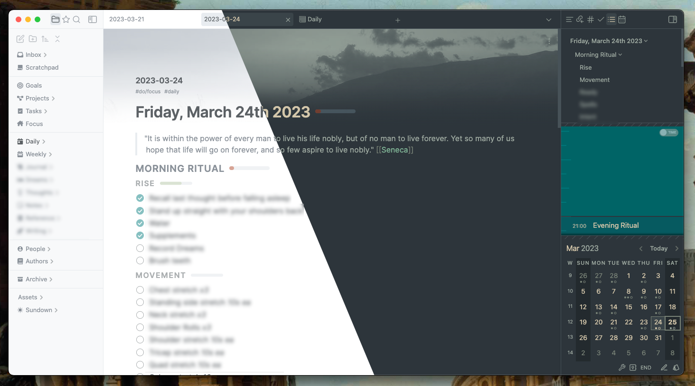

My working folder of CSS snippets for Obsidian configured with the [Minimal Theme](https://github.com/kepano/obsidian-minimal). The purpose is to extend Obsidian UI possibilities and also visually harmonize the style of various plugins with `Minimal Theme`, with a preference for compact UI. Updated regularly. Screenshots below. Some snippets will probably work fine on default or other themes.

## How to use

1. Clone/[fork](https://github.com/replete/obsidian-minimal-theme-css-snippets/fork)/[unzip](https://github.com/replete/obsidian-minimal-theme-css-snippets/archive/refs/heads/main.zip) into `<your vault location>/.obsidian/snippets` or use 'Snippet Downloader' plugin
2. (recommended) Install the [MySnippets plugin](https://github.com/chetachiezikeuzor/MySnippets-Plugin) via 'Community plugins' to easily manage snippets    
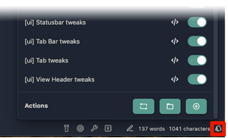
4. Check periodically for updates and new goodies

## Support development


<a href="https://www.buymeacoffee.com/replete"></a>

## My environment

- `MacOS 13.6.1` (I'm holding off on Sonoma, doubtful this will be a problem for you however)
- `Obsidian v1.4.16 (installer 1.4.13)` Desktop, if installer < 1.1.8 reinstall from official installer to update electron for updated CSS features like `:has()` - homebrew update didn't work for this version)
- `Minimal Theme v7.3.5`
```js
// [...new Set(app.plugins.enabledPlugins)]
['obsidian-advanced-uri', 'obsidian-attachment-name-formatting', 'auto-class', 'calendar', 'obsidian-checklist-plugin', 'cmdr', 'obsidian-custom-attachment-location', 'custom-sort', 'obsidian-custom-frames', 'dataview', 'dbfolder', 'draw-harada-method', 'folder-note-plugin', 'obsidian-hide-sidebars-when-narrow', 'hotkeysplus-obsidian', 'obsidian-hover-editor', 'obsidian-icon-folder', 'obsidian-excalidraw-plugin', 'cm-editor-syntax-highlight-obsidian', 'obsidian-minimal-settings', 'obsidian-meta-bind-plugin', 'open-in-new-tab', 'open-vscode', 'periodic-notes', 'quickadd', 'obsidian-quiet-outline', 'obsidian-smart-typography', 'obsidian-style-settings', 'obsidian-task-progress-bar', 'obsidian-tasks-plugin', 'templater-obsidian', 'obsidian-toggle-list', 'make-md', 'mysnippets-plugin', 'nldates-obsidian', 'no-dupe-leaves', 'file-explorer-note-count', 'obsidian-columns', 'ob-table-enhancer', 'easy-toggle-sidebars', 'obsidian-daily-note-outline', 'settings-search']
```

## Editor Snippets
- **Custom Tag Styles** - I'm not using tags much at the moment, but prefer the more compact look than the pill shaped. If I use tags more I'll extend this.
    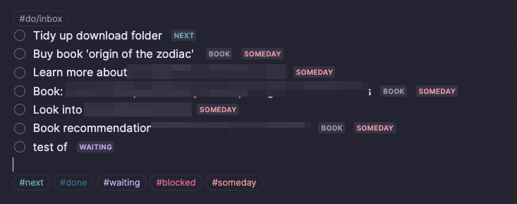
- **Editor fixes** - gutter component alignments, general editor fixes, less visible indentation guide
- **Frontmatter tweaks** - styling, fixes for `editor syntax highlighter plugin`
- **Mono Emojis everywhere** - uses mono emoji font (activate separately) for everything in an editor (this is actually pretty ugly and I don't use it)  
- **Table tweaks** - WIP, still waiting for a good table editing plugin...
- **Top Fade** - Remove harsh edge of content when using "Compact Tabs (classic)" with one of the positional Tab Header snippets (I prefer the Translucent Tab Header)
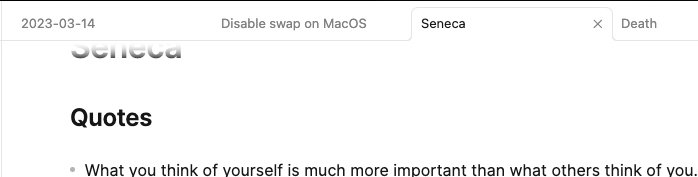
- **Typography fixes** - alignment fixes for editor, headings, list items quotes etc (WIP)
    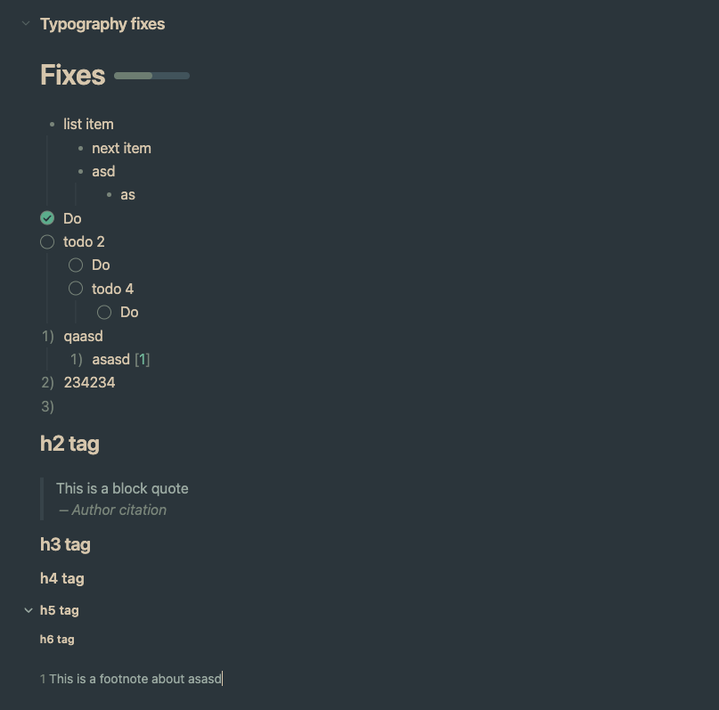
## Font snippets:
- **Mono Emojis** - embedded Noto Emoji variable font (2MB snippet!) - not recommended
## UI snippets:
- **Collapsible Right Headers** - Hide panel headers until hover in the right sidebar.
    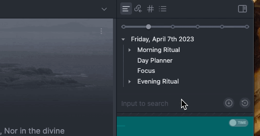
- **Compact File Explorer** - Compact styles, chevrons on right, makes attachment folders less visible    
    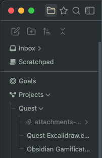    
- **Compact Properties (+autohide)** - Compact Properties (Obsidian 1.4.5 feature) with hover autohide, just like the Make.MD snippet [note: I keep the Make.MD + snippets enabled for the banner functionality]
    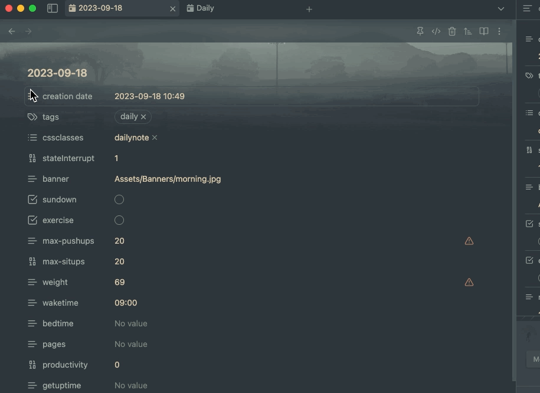
- **Compact Tab Header** - Compact icons in toolbar, also fixes `Commander` plugin icon colours    
    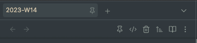
- **Compact Tabs** - Compact firefox-style pill tabs, better for smaller screens     
    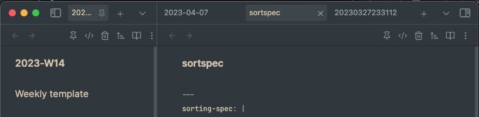
- **Compact Tabs (classic)** - Compact classic tabs, better for smaller screens    
    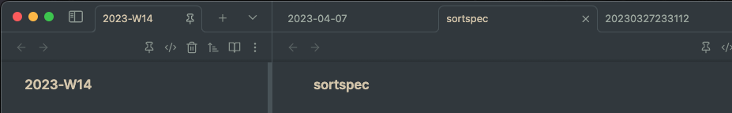
- **Custom Separators** - user-configurable CSS for separators, works well with `File Explorer Custom Sorting` plugin    
    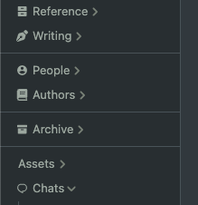
- **Custom Separators (gradient)** - user-configurable CSS for separators, works well with `File Explorer Custom Sorting` plugin    
    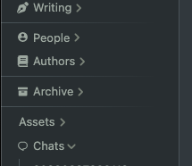
- **Floating Tab Header** - Save space with this float right leaf tab header (show navigation, breadcrumb on hover/focus)    
    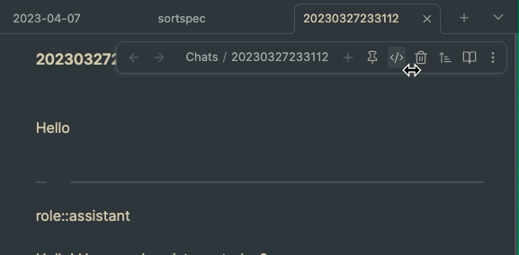
- **Floating Tab Header (mini)** - Save even more space with this float right leaf tab header (show navigation, breadcrumb on hover/focus)    
    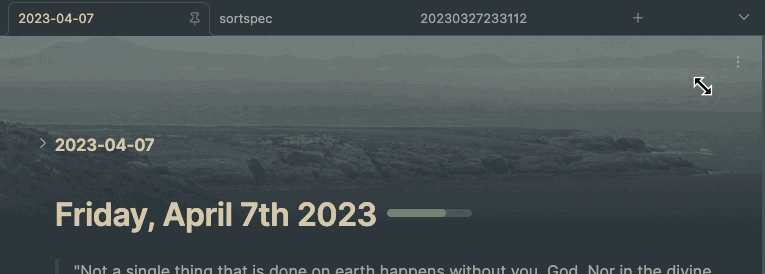
- **Hide Ribbon**
- **Hide Vault Title in Sidebar**
- **Resize Handles - prefer more muted theme colours**
- **Restrict Last Right Sidebar  Panel (e.g. for calendar plugin)** - Sets max-height on last right sidebar panel, saving you from constantly resizing the panel when resizing windows    
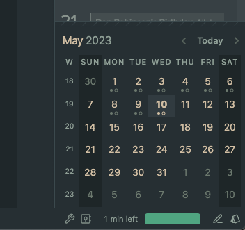 
- **Status bar tweaks** - more visible text on dark theme 
- **Tab Header on bottom** - Move the tab title bar to the bottom, vertical statusbar when right sidedock closed
    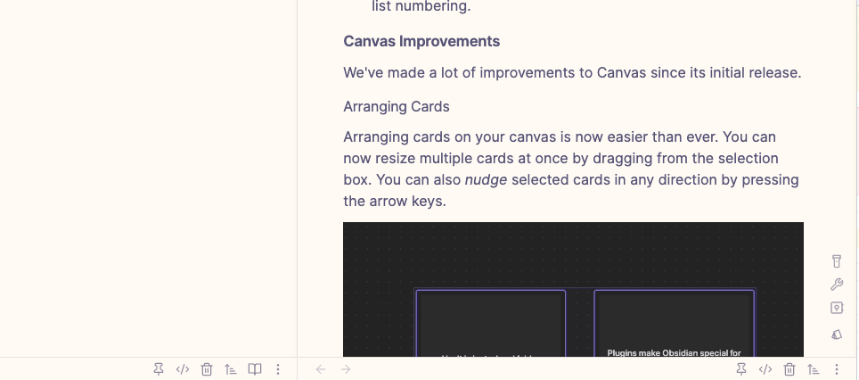
- **Translucent Tab Header** - Classic style tab header showing blurred document content underneath
    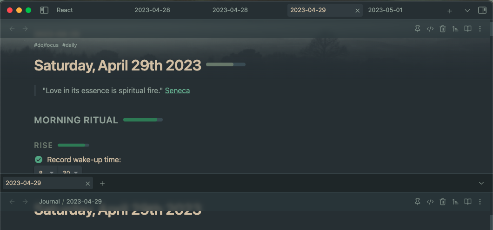
### User Snippets:
- **Daily Note styles** - supporting styles for my daily note template, scoped to notes with `cssclass: dailynote` in frontmatter
- **Themed accents** - Custom accent colours for each minimal theme subtheme 
    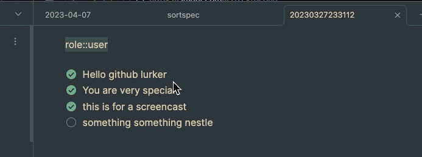

### Plugin snippets
- **Calendar** - Compact, weekend, day styles, colours    
    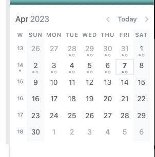
- **CardBoard** - Compact styles, waiting on feature update so WIP
    
 
- **Checklist (Ultra compact)** - Compact view (for tag mode users)    
    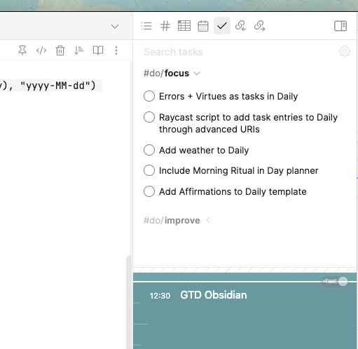
- **Custom Frames** - Compact panel
- **Custom Frames (Duotone)** - blend custom frames content in with theme until hover    
    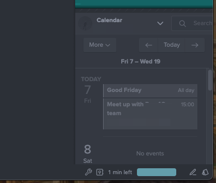
- **Daily Note Outline** - Compact, visual tweaks, works with compact file explorer snippet    
    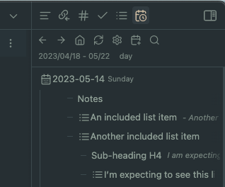
- **Database Folder (Compact)** - compact view    
    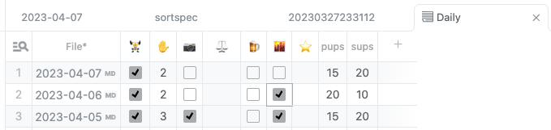
- **Excel** - Follows minimal colour theme for plugin UI (excluding spreadsheet editor, which is a rendered canvas), tidy up some UI metrics
    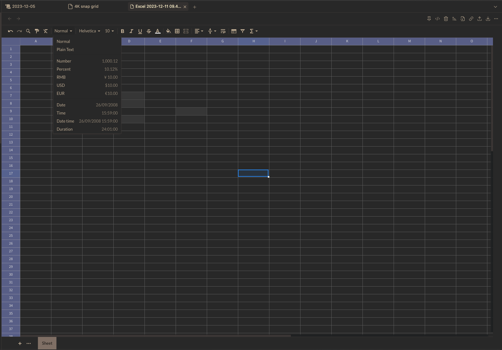
- **Make.MD Inline Context** - Compact Make.md Contexts, tidier layout (Obsidian shipped Properties feature in 1.4.5 which makes this redundant, though I still have enabled for a few styles)
    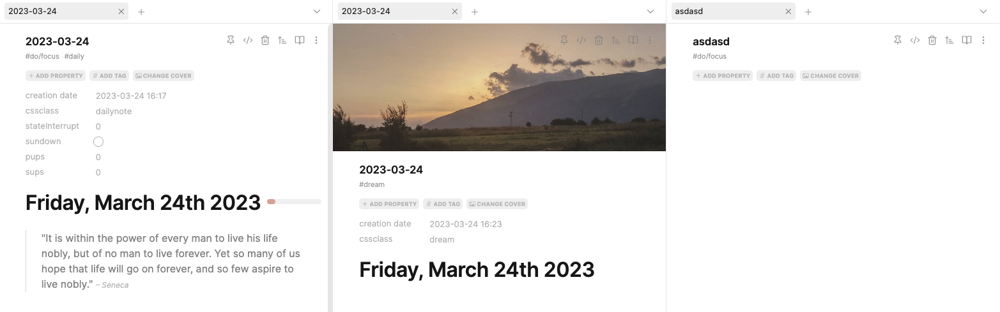
- **Make.MD Inline Context: Auto-hide meta** -    
    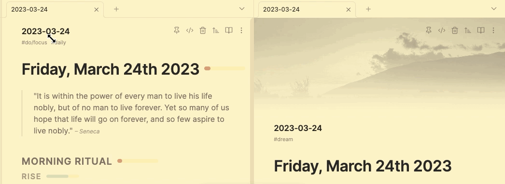

- **Make.MD Inline Context: Duotone Banner** - Makes all banner images duotone to match minimal theme    
    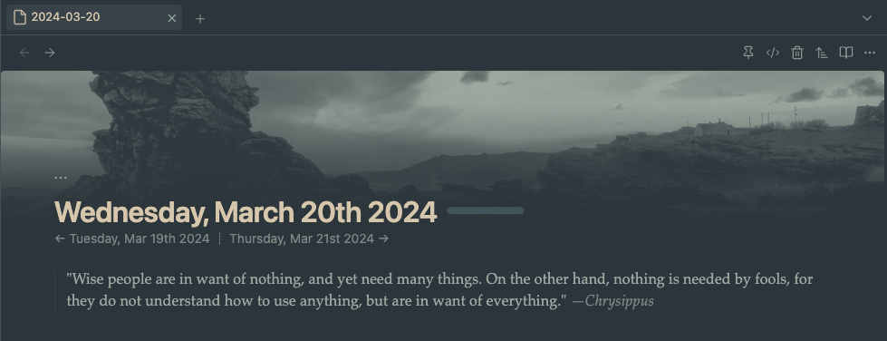
- **Make.MD Inline Context: Faded Banner**  Fade images to background with a gradient    
    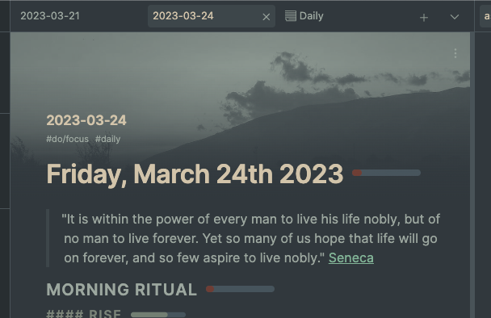
- **MySnippets** - make menu wider and fix button style/order    
    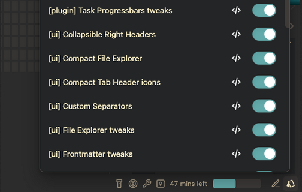
- **Outline** - chevron on right, compact    
    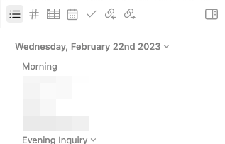
- **Quiet Outline** - Remove rainbow colours to theme colors, re-arrange layout (I use this instead of Outline panel)
    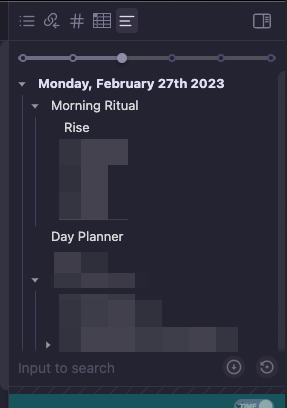
- **Tasks - Mono Icons (lucide2)** - Lucide2 Monotone icon set for Tasks Emoji Format, generated by [this tool I made](https://github.com/replete/obsidian-tasks-custom-icons)     
    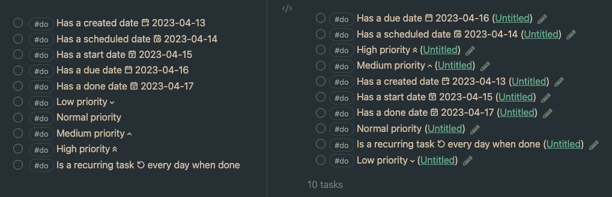
- **Tasks - Compact** - Dates/backlink as tooltip. Colour-based priority. Incudes ['lucide2' monochrome tasks emojis](https://github.com/replete/obsidian-tasks-custom-icons).
    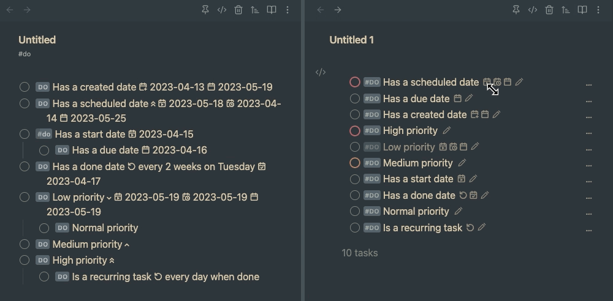
- **Task progressbars** - alignments and colours
    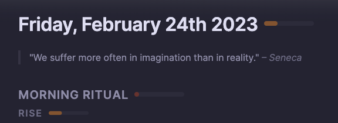
    
## Abandoned snippets (no longer developed)
- **Heatmap Calendar** - colours and text styles for habit type use-case [(imgur screenshot)](https://i.imgur.com/ndvRLIC.png)
- **Full Calendar** - pretty hacky due to limits of styling hooks
- **Obsidian Buttons** - alignments
- **Day Planner** - ~~I'm using [my own fork](https://github.com/replete/obsidian-day-planner) of this abandoned plugin for more features but the styles here are not dependent on fork changes, yes its still buggy~~ Apparantly this plugin has a new maintainer, but I've stopped using it so these styles are for an older v
    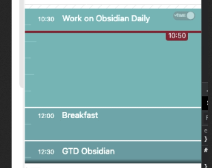    

## Deprecated snippets (deleted from repo)
- ~~[Make.MD Banner](https://i.imgur.com/bn5bfMS.gif) - Mostly banner cssclass overrides, gradient, blur, tall, short etc - I refactored/improved this into separate snippets above~~
- ~~Make.MD Compact Spaces - use less space, like Compact File Explorer snippet (deprecated)~~

## Support development
<a href="https://www.buymeacoffee.com/replete"></a>

## TODO
- [ ] Fix the weird list item alignments that vary depending on file length
- [ ] Test/fix for Mobile Obsidian
- [x] Fix colour inconsistencies across light/dark themes
- [x] Test/fix for Windows (no fixes needed at time)
- [x] Test/fix for Linux (no fixes needed at time)

