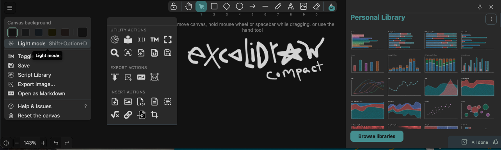

# Obsidian CSS snippets for Minimal Theme


My working folder of CSS snippets for Obsidian configured with the [Minimal Theme](https://github.com/kepano/obsidian-minimal). The purpose is to extend Obsidian UI possibilities and also visually harmonize the style of various plugins with `Minimal Theme`, with a preference for compact UI. Updated regularly. Screenshots below. Some snippets will probably work fine on default or other themes.

## How to use

Clone/[fork](https://github.com/replete/obsidian-minimal-theme-css-snippets/fork)/[unzip](https://github.com/replete/obsidian-minimal-theme-css-snippets/archive/refs/heads/main.zip) into `<your vault location>/.obsidian/snippets` or use 'Snippet Downloader' plugin
I recommend installing the [MySnippets plugin](https://github.com/chetachiezikeuzor/MySnippets-Plugin) via 'Community plugins' to easily manage snippets with a statusbar popup menu:


## Support development


<a href="https://www.buymeacoffee.com/replete"></a>


## Updates (scroll to next section for snippet details)
- **2025-03-22** Added File Explorer Header Autohide snippet. Hides the file explorer header until hovered over (I never use this and it looks better without it).

- **2025-03-21** New Compact File Explorer snippet (renamed old to 'Legacy'). No more jankiness. Chevrons hidden at top level, made subtle and other tweaks. Much better. Tweaked 'Compact Sidebar' snippet also, both pictured below.

- **2024-12-20** Added SheetsPlus - Dark Mode snippet. Mega hacky as JS spreadsheets are usually canvas-based, but it's better than being flashbanged by a screen of pure white. Only applies if a dark theme is active.

- **2024-11-05** Version bump to 1.7.5. Installed from Obsidian Installer to get Electron 32 (=Chromium v120 features like `color-mix`,`color-contrast`, and css container queries)
- **2024-10-17** Fixed Compact File Explorer for Obsidian 1.7x
- **2024-09-19** Renamed Compacter Tab Header to Ultra Compact Tab Header. What was I thinking when I named that one...
- **2024-09-06** Fixed Excalidraw Compact. Fixed Ultra Compact. Added Ultra Compact Sidebar. 
- **2024-09-05** Compact File Explorer refactor and bugfix. Notes on startup padding JS fix in snippet header comment.
- **2024-09-05** Added Ultra Compact snippet. Ultra Compact Sidebar snippet. 
- **2024-09-05** Added Excalidraw - Compact Snippet. Added Compact-er Tab Header. 
- **2024-08-31** Renamed `[ui] Compact Sidebar Header.css` to `[ui] Compact Sidebar.css`. Made vault selector compact.

- **2024-06-11** Obsidian 1.6 fixes: Fixed Custom Separators and Compact File Explorer snippets
- **2024-05-17** Added [Sticky Headings for Daily Note](#user-snippets)
- **2024-04-09** MakeMD banners broke for me again. Might be a conflict of some kind. I've submitted an [issue on their github](https://github.com/Make-md/makemd/issues/297) so chip in if you also have the same problem.
- **2024-03-20** MakeMD Banners are back. Thankfully they've sorted out whatever was going on, so I've refactored the snippets entirely, and it works much better with less code.
- **2024-03-17** Added new Omnisearch plugin visual fixes. I've made a number of changes in recent commits but haven't updated notes. At some point I'll update screenshots and things.
- **2024-02-21** Disabled a number of plugins for performance reasons. Trying out ollama embeddings plugin, but its early days.
- **2024-02-21** Works on mobile. MakeMD banners stopped working again, combined with the broken inline file context I've chosen to just give up and disable MakeMD for now. I'll live without the pretty banners, it's a shame to lose this nice functionality but there are no other banner plugin alternatives that work and MakeMD is no longer worth dealing with. I'll leave the banner functionality here but if it works for you now, updating it may cause you problems.
- **2024-02-08**: MakeMD's inline context (filename in editor) has broken for a while, I've refactored CSS and reinstalled MakeMD but ths bug remains, so for some new files the inline context filename does not show. Reinstalling MakeMD did make my banner show again however and I've fixed the CSS for it. If you have problems, try uninstalling and reinstalling the plugin and reseting the options (disable everything but `Sync Context Fields..., Flow (beta), Inline Context, Flow Block, Open Flow Blocks...` if you wish to replicate my setup, which these snippets are configured for). I only use MakeMD for the banner functionality as there's no other option right now, and look forward to getting rid of this plugin entirely in the future.

## My environment

- `MacOS 15`, `Android 13`, `Windows 11` (sometimes), `Linux` (sometimes)
	- Windows 11 and Linux might need little tweaks in snippets that deal with native titlebar controls, welcome fixes if needed but probably only an issue in a few snippets
- `Obsidian v1.8.9 (installer v1.8.9)` Desktop
	- NOTE: If your installer version is less than 1.1.8, you _must_ reinstall from official installer to update electron for updated CSS features like `:has()`
- `Minimal Theme v7.7.19`
```js
// plugins I have enabled (32):
['obsidian-advanced-uri', 'auto-class', 'calendar', 'cmdr', 'hotkeysplus-obsidian', 'obsidian-icon-folder', 'obsidian-excalidraw-plugin', 'cm-editor-syntax-highlight-obsidian', 'obsidian-minimal-settings', 'obsidian-meta-bind-plugin', 'open-vscode', 'periodic-notes', 'quickadd', 'obsidian-task-progress-bar', 'templater-obsidian', 'mysnippets-plugin', 'no-dupe-leaves', 'file-explorer-note-count', 'easy-toggle-sidebars', 'settings-search', 'custom-sort', 'obsidian-shortcut-launcher', 'obsidian-contextual-typography', 'open-in-new-tab', 'obsidian-tracker', 'omnisearch', 'snippet-commands-obsidian', 'dataview', 'meld-encrypt', 'obsidian-day-planner', 'sticky-heading', 'sheet-plus']
// [...new Set(app.plugins.enabledPlugins)]
```

> ⭐ A star beside the follow snippet titles indicate I have it enabled in my vault (and should work well for you too as a default configuration)
## Editor Snippets
- **Custom Tag Styles** ⭐ - I'm not using tags much at the moment, but prefer the more compact look than the pill shaped. If I use tags more I'll extend this.
    
- **Compact Right Sidebar notes** ⭐ - This shortens the margins and enables a duotone when not hovering for when a note is open in the right panel workspace (reading view atm)
- **Editor fixes** ⭐ - gutter component alignments, general editor fixes, less visible indentation guide
- **Frontmatter tweaks** ⭐ - styling, fixes for `editor syntax highlighter plugin`
- **Table tweaks** ⭐ - WIP, still waiting for a good table editing plugin...
- **Top Fade** - Remove harsh edge of content when using "Compact Tabs (classic)" with one of the positional Tab Header snippets (I prefer the Translucent Tab Header)

- **Typography fixes** ⭐ - alignment fixes for editor, headings, list items quotes etc (WIP)
    
## UI snippets:
- **Collapsible Right Headers** ⭐ - Hide panel headers until hover in the right sidebar.
    
- **Compact File Explorer (new)** ⭐ - Compact styles, hidden top-level chevrons, jankiness fully removed.

- **Compact Properties (+autohide)** ⭐ - Compact Properties (Obsidian 1.4.5 feature) with hover autohide, just like the Make.MD snippet [note: I keep the Make.MD + snippets enabled for the banner functionality]
    
- **Compact Tab Header** - Compact icons in toolbar, also fixes `Commander` plugin icon colours
    
- **Ultra Compact Tab Header** ⭐ - Compact icons in ultra toolbar, also fixes `Commander` plugin icon colours
    
- **Compact Sidebar** ⭐ - Compact top sidebar nav, file explorer nav header, and make vault selector footer compact.
	
- **Compact Tabs** ⭐ - Compact firefox-style pill tabs, better for smaller screens
    
- **Compact Tabs (classic)** - Compact classic tabs, better for smaller screens
    
- **Custom Separators** ⭐ - user-configurable CSS for separators, works well with `File Explorer Custom Sorting` plugin
    
- **Custom Separators (gradient)** - user-configurable CSS for separators, works well with `File Explorer Custom Sorting` plugin
    
- **File Explorer Header Autohide** ⭐ - Hides the file explorer header until hovered over (I never use this and it looks better without it)

- **Floating Tab Header** - Save space with this float right leaf tab header (show navigation, breadcrumb on hover/focus)
    
- **Floating Tab Header (mini)** - Save even more space with this float right leaf tab header (show navigation, breadcrumb on hover/focus)
    
- **Native Scrollbar styles** ⭐ - make scrollbars way nicer and color themed
- **Resize Handles** ⭐ - prefer more muted theme colours
- **Restrict Last Right Sidebar Panel** ⭐ - Sets max-height on last bottom right sidebar panel, saving you from constantly resizing the panel when resizing windows (e.g. for the calendar plugin panel, which is to me essential)

- **Status bar tweaks** ⭐ - more visible text on dark theme
- **Tab Header on bottom** - Move the tab title bar to the bottom, vertical statusbar when right sidedock closed

- **Tab Header show path and title** ⭐ - I've disabled inline context filename editing and rely on this now, this shows the filename always without hover and allows rename with one click
- **Translucent Tab Header** - Classic style tab header showing blurred document content underneath (NOTE: its pretty, but on large documents causes performance issues delaying text due to the constant reflows caused by the graphical effect)
    
- **Ultra Compact** - Super small navigation tabs, smaller toolbar icons, shorter file explorer. Usecase: tiny screen
    
- **Ultra Compact Sidebar** - Hardcodes sidebar to 135px. Goes well with Ultra Compact snippet. Caveats: mouse resize not possible, resize animation broken
    
### User Snippets:
- **Daily Note styles** ⭐ - supporting styles for my daily note template, scoped to notes with `cssclass: dailynote` in frontmatter
- **Daily Note (Sticky Headings)** ⭐ - requires 'Sticky Headings' plugin, and disables the stick view for anything other than `cssclass: dailynote`
    
- **Themed colours** ⭐ - Custom accent colours for each minimal theme subtheme, I like switchng minimal colour theme ocassionally and this ensures the accent color is overridden with a color that makes sense for the theme without needing to manually set it
    

### Plugin snippets
- **Calendar** ⭐ - Compact, weekend, day styles, colours, essential plugin for me
    
- **Custom Frames** ⭐ - Compact panel
- **Custom Frames (Duotone)** ⭐ - blend custom frames content in with theme until hover
    
- **Day Planner (Ivan Lednev's version)** ⭐ - Ivan has done an amazing job at reviving this plugin. I think this version is the best of those available on Community Plugins. This snippet makes the header a little more compact (I am a compact UI fiend)
    
- **Daily Note Outline** ⭐ - Compact, visual tweaks, works with compact file explorer snippet
    
- **Database Folder (Compact)** - compact view
    
- **Excalidraw (Compact)** ⭐ - Controls more compact, bigger icons, bigger library, tidier floating utilities island, colour fixes. Note: Screens are bright nowadays so I use dark mode exclusively, light mode works but I hardcoded a colour for control backgrounds that you might not like, designed for a white canvas...). Not tested on mobile, but probably fine...
    
- **Make.MD Inline Context** ⭐ - Only used for banner functionality, inline context components are hidden. To use, add a `banner` property to a note's frontmatter directly or via Properties (see Autohide snippet)
    
- **Make.MD Inline Context: Duotone Banner** ⭐- Makes all banner images duotone to match minimal theme
    
- **Make.MD Inline Context: Faded Banner** ⭐ Fade images to background with a gradient, and offsets text
    
- **Meta Bind (Compact)** ⭐ - Inline controls are more compact, with customizations to some controls
- **MySnippets** ⭐ - make menu wider and fix button style/order
    
- **Omnisearch** ⭐ - Cleaner styles, less visual noise
    
- **Outline** - chevron on right, compact
    
- **Quiet Outline** - Remove rainbow colours to theme colors, re-arrange layout (I use this instead of Outline panel)
    
- **Sheets Plus Dark Mode** ⭐ - Dark mode hack for spreadsheets. Only applies if a dark theme is active.
	
- **Task progressbars** ⭐ - alignments and themed colours
    
- **Tracker** ⭐ - cleaner styles and duotone on hover

## No longer developed (I don't use these styles anymore)
- **Compact File Explorer Legacy** - Compact styles, chevrons on right, makes attachment folders less visible. A bit janky and now redundant.
    
- **Mono Emojis everywhere** - uses mono emoji font (activate separately) for everything in an editor (this is actually pretty ugly and I don't use it)
- **Heatmap Calendar** - colours and text styles for habit type use-case [(imgur screenshot)](https://i.imgur.com/ndvRLIC.png)
- **Full Calendar** - pretty hacky due to limits of styling hooks
- **Obsidian Buttons** - alignments
- **Excel** - Follows minimal colour theme for plugin UI (excluding spreadsheet editor, which is a rendered canvas), tidy up some UI metrics
    
- **Day Planner (old version)** - ~~I'm using [my own fork](https://github.com/replete/obsidian-day-planner) of this abandoned plugin for more features but the styles here are not dependent on fork changes, yes its still buggy~~ Apparantly this plugin has a new maintainer, but I've stopped using it so these styles are for an older v
    
- **Tasks - Mono Icons (lucide2)** - Lucide2 Monotone icon set for Tasks Emoji Format, generated by [this tool I made](https://github.com/replete/obsidian-tasks-custom-icons)
    
- **Tasks - Compact** - Dates/backlink as tooltip. Colour-based priority. Incudes ['lucide2' monochrome tasks emojis](https://github.com/replete/obsidian-tasks-custom-icons).
    
- **Checklist (Ultra compact)** - Compact view (for tag mode users)
    
- **CardBoard** - Compact styles, waiting on feature update so WIP
    
- **Smart 2nd Brain (compact)** - Some basic styles to fix some of the UX of this plugin, there are no class selectors in the plugin UI so its extremely hacky but makes it more compact
    
- **Mono Emojis** - embedded Noto Emoji variable font (2MB snippet!) - not recommended

## Deprecated snippets (deleted from repo)
- **Hide Ribbon** - built-in to Obsidian now in settings
- **Hide Vault Title in Sidebar** - hide the vault name in the left, makes sense if you only ever use one vault (removed from obsidian)
- ~~[Make.MD Banner](https://i.imgur.com/bn5bfMS.gif) - Mostly banner cssclass overrides, gradient, blur, tall, short etc - I refactored/improved this into separate snippets above~~
- ~~Make.MD Compact Spaces - use less space, like Compact File Explorer snippet (deprecated)~~
- ~~Make.MD Inline Context - Autohide meta ~~

## Support development
<a href="https://www.buymeacoffee.com/replete"></a>

## TODO
- [x] Test/fix for Mobile Obsidian
- [x] Fix the weird list item alignments that vary depending on file length
- [x] Fix colour inconsistencies across light/dark themes
- [x] Test/fix for Windows (no fixes needed at time)
- [x] Test/fix for Linux (no fixes needed at time)

